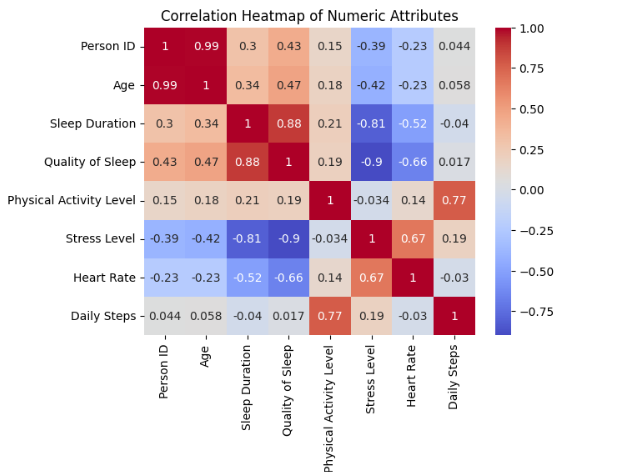
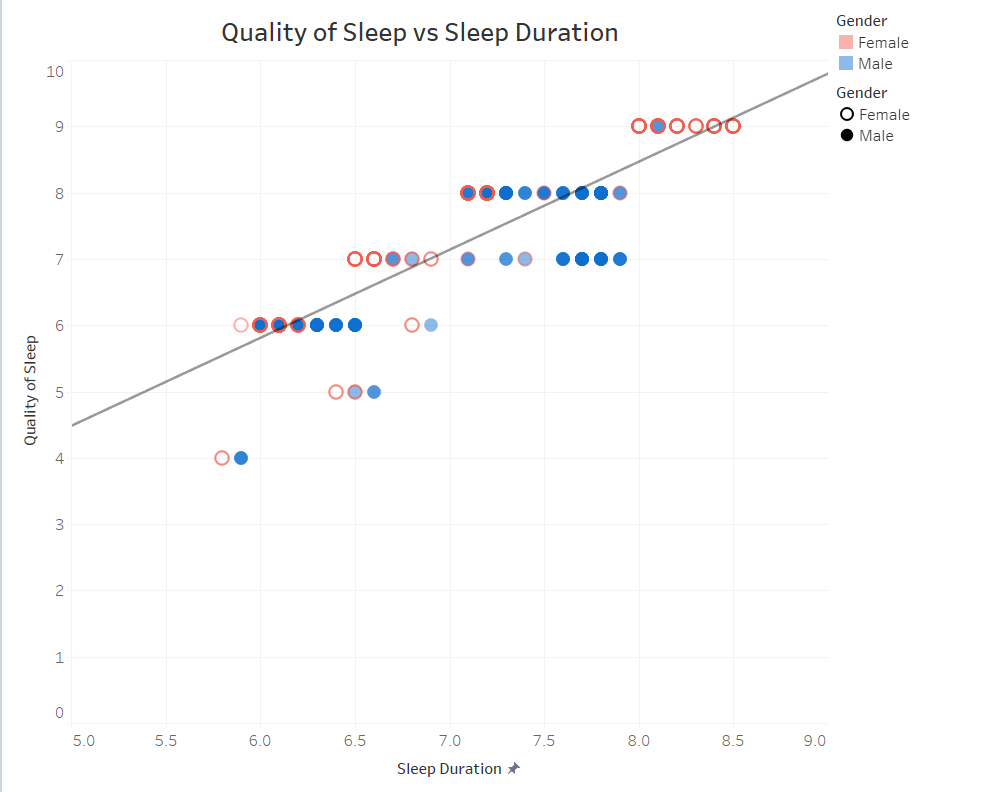
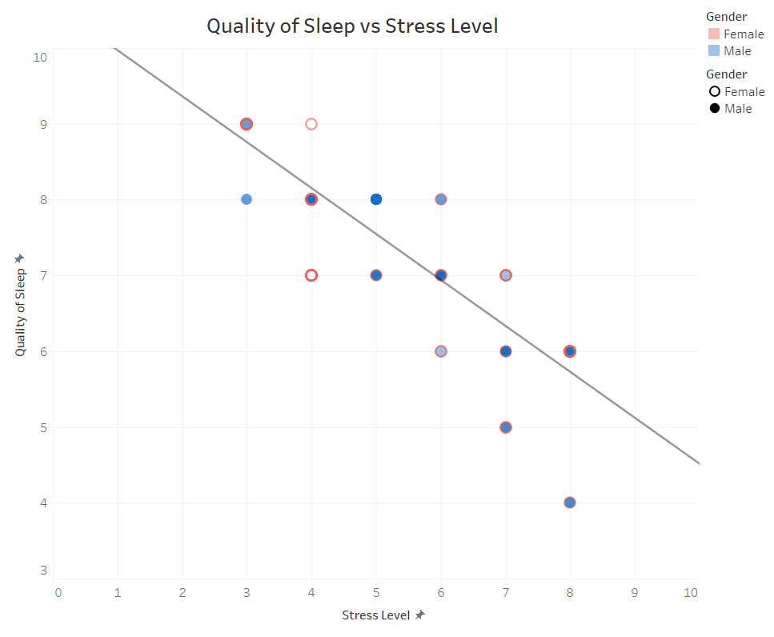
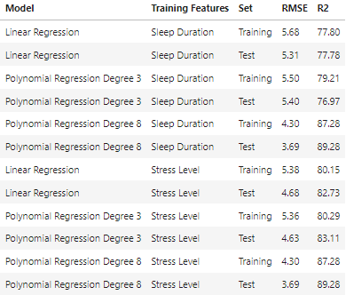

# capstone-project

## Laura Gagnon-Vos

This project explores sleep health in humans by taking into account the various factors that may affect sleep quality, including health metrics, lifestyle, gender, and age. The project utilizes machine learning methods, specifically linear regression modeling, to help determine what plays an important role in quality of sleep. 

The final report for this project was created using LaTex in Overleaf. 
[Overleaf Report](https://www.overleaf.com/read/xdknsvhdhnrs#ca4e7a) 

Data for this project was sourced from: [Sleep Health and Lifestyle Dataset](https://www.kaggle.com/datasets/uom190346a/sleep-health-and-lifestyle-dataset/data)

## Project Steps:
1. Data collection
    - Data was collected from [Sleep Health and Lifestyle Dataset](https://www.kaggle.com/datasets/uom190346a/sleep-health-and-lifestyle-dataset/data) and the CSV file was downloaded and imported into VS code for further use.
2. Data cleaning and preprocessing
    - Initial data overview and cleaning was done using Excel, then Python in VS Code
    - Inconsistent values were corrected and additional attributes added
3. Exploratory Data Analysis (EDA)
    - EDA was conducted using Python in a Jupyter Notebook.
    - Analysis was conducted to determine features important to Quality of Sleep.
    - Features found to have a strong relationship were visualized using scatter plots, bar charts, heat maps, and tables.
4. Machine Learning
    - Predictive analysis was conducted using several types of linear regression modeling including linear regression and polynomial regression to the 3rd and 8th degrees.
    - The model was trained on the features Sleep Duration and Stress Level (determined during the EDA process) and performance was evaluated using R2 and RMSE values.

   
## Features Used for Analysis
1. Person ID: A unique numeric identifier for each individual in the study
2. Gender: The gender of the individual studied (Male or Female).
3. Age: The age of the individual in years (Ages range from 27-59).
4. Occupation: The occupation/profession of the individual.
5. Sleep Duration: The duration of the individual’s time spent asleep, expressed
in number of hours.
6. Quality of Sleep: The perceived quality of the individual’s sleep, expressed
on scale from 1-10. This is a subjective rating by the individual.
7. Physical Activity Level: The amount of time the individual spends engaging
in physical activity daily, expressed in minutes (per day).
8. Stress Level: The perceived stress level of the individual, expressed on a scale
from 1-10. This is a subjective rating by the individual.
9. BMI Category: The BMI category of the individual corresponding to their
BMI(Underweight, Normal, or Overweight).
10. Blood Pressure: The blood pressure measurement of the individual, indicated
as systolic/diastolic pressure.
11. Heart Rate: The resting heart rate of the individual, expressed in beats per
minute (bpm).
12. Daily Steps: The number of steps per day of the individual.
An Analysis of Sleep Health in Humans 3
13. Sleep Disorder: The presence/absence of a diagnosed sleep disorder of the
individual (None, Insomnia, or Sleep Apnea).
Of the attributes readily available from the data set, all were treated as inde-
pendent variables, except ‘Quality of Sleep,’ which was treated as a dependent
variable. It is important to note that ‘Sleep Duration’ and ‘Sleep Disorder’ may
be treated as additional dependent variables. However, in light of this project,
they were treated as factors contributing to sleep quality and thus as independent
variables.

An additional attribute was created during the data cleaning and preprocession step:

14. Overall Exercise Level: The overall amount of exercise of the individual, as
calculated from Physical Activity Level and Daily steps, or attributes 7 and 12,
respectively (High, Medium, or Low).

## Key Results
1. Correlation
  - Attributes with the highest correlation to Quality of Sleep were Duration of Sleep and Stress Level
    
    
    
2. Visualization of highest correlated attributes
  - Scatterplot showing positive linear relationship between Quality of Sleep vs Sleep Duration
    

  - Scatterplot showing negative linear relationship between Quality of Sleep vs Stress Level
    

3. Model Performance
  - Of the models used, Polynomial Regression to the 8th Degree performed the best for both features, with high R2 and low RMSE for both features examined.
    

    

## Prerequisites
Prior to setting up the virtual environment, you must have Python and pip installed.

## Virtual Environment Setup
1. Clone repository and navigate to project directory in VS Code.
2. Create virtual environment: py -m venv .venv
~~~
python -m venv .venv
~~~
  
3. Activate virtual environment: 
~~~
.venv\Scripts\activate
~~~
   
4. Install dependencies:
~~~
pip install -r requirements.txt
~~~

